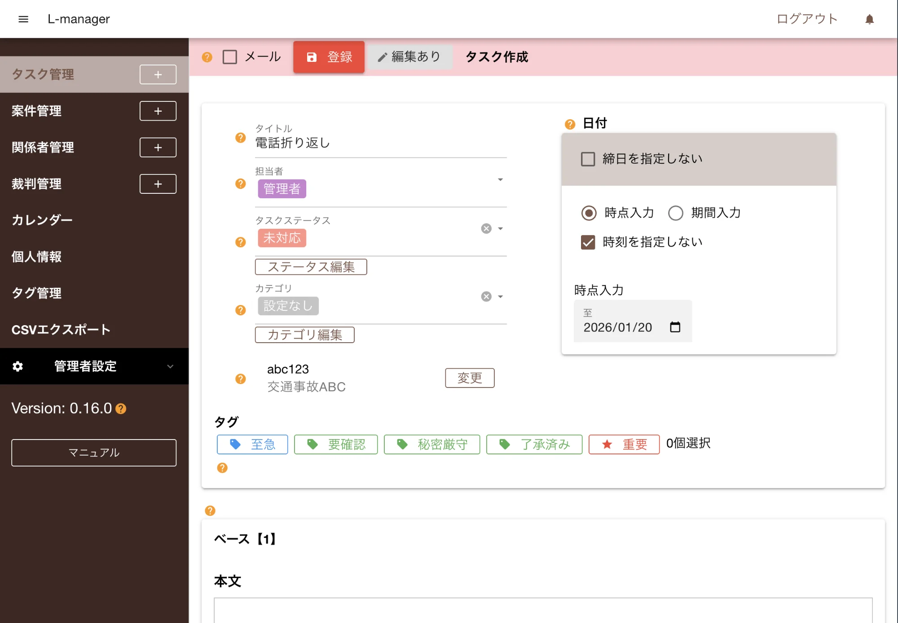
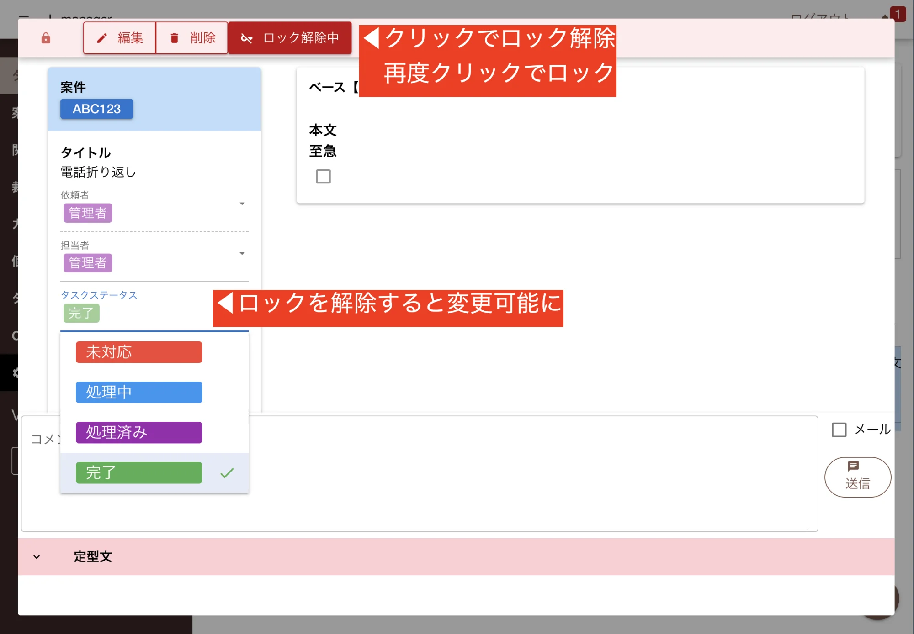

L-managerへようこそ。本ページではアカウント作成から基本的な初期設定、タスクの登録など必要最小限のガイドで基本操作をマスターできるようにまとめています。  
所要時間は15分ほどです。早速始めてみましょう。

## アカウントを作成する

1. [L-managerを起動](https://taskmanh.web.app/)するとログイン画面が表示されます
2. アカウントの作成をクリック
3. E-mailとパスワードを入力の上、新規登録をクリック
4. 利用規約に同意して下さい
5. 初期化が開始されます

## 従業員のアカウントを追加する

L-managerは複数人で同時に使用可能です。従業員のアカウントを作成することで従業員ごとにタスクの担当を割り当てることができるようになります。

1. 左メニュー：管理者設定をクリック
2. スタッフ管理をクリック
3. 画面右上の「追加」ボタンをクリック
4. 必要事項を入力
5. 登録をクリック

より詳細なガイドは[スタッフアカウント管理](/docs/other/staffmanage/)を御覧ください。

## 案件を登録する

お客様から依頼を受けた仕事１つ１つが案件です。案件を登録することで、関連する案件とタスク（やることリスト）が紐づけて効率よい管理が可能になります。

1. 左メニュー：案件管理の行にある＋ボタンをクリック
2. 必要事項を以下の通りに入力
3. 画面左上にある「登録」ボタンをクリック
4. 登録後、「一覧に戻る」をクリック
5. 案件一覧に先程登録したデータが有ることを確認してください

必要事項については以下のように入力して下さい

<dl class="basic">
<dt>タイトル</dt>
<dd>交通事故ABC</dd>
<dt>案件番号</dt>
<dd>abc123</dd>
<dt>案件ステータス</dt>
<dd>受任済み</dd>
<dt>項目種類</dt>
<dd>事務所事件</dd>
<dt>案件種類</dt>
<dd>調査</dd>
<dt>顧客種類</dt>
<dd>その他個人</dd>
</dl>

:::note[練習なので気軽に入力して下さい]
この案件はテストデータです。削除の練習で消しますので内容を深く考える必要は有りません
:::

:::tip[案件テンプレートは変更可能]
お使いの事務所に応じてテンプレートを自由自在にカスタマイズできます。
:::

## タスクを登録する

タスクは直訳すると「仕事」ですが、もっと広く「予定」や「やることリスト」のように解釈してください。
些細な事項でもどんどん登録していきましょう。タスクと案件を紐づけることもできます。

1. 左メニュー：タスク管理の行にある＋ボタンをクリック
2. 必要事項を以下の通りに入力
3. 画面左上にある「登録」ボタンをクリック
4. 登録後「一覧に戻る」をクリック
5. タスク一覧に先程のタスクが登録されていることを確認して下さい

必要事項については以下のように入力して下さい

<dl class="basic">
<dt>タイトル</dt>
<dd>電話折り返し</dd>
<dt>担当者</dt>
<dd>管理者</dd>
<dt>タスクステータス</dt>
<dd>未対応</dd>
<dt>カテゴリ</dt>
<dd>指定なし（初期値のまま）</dd>
<dt>案件番号</dt>
<dd>abc123(クリックすると一覧に表示されます)</dd>
<dt>日付</dt>
<dd>変更せずそのまま（自動で本日の日付になる）</dd>
</dl>

## カレンダーから登録されたタスクを確認

タスクを登録するとカレンダー上にタスクが表示されます。タスクで指定した日時を基準に表示されます。

1. 左メニュー：カレンダーをクリック
2. カレンダー上に「電話折り返し」のタスクがあることを確認する

カレンダー上からタスクが確認できました。タスクをクリックすることで詳細表示することもできます。

## タスクの状態を変更する

タスクが終わったら完了済みに切り替えることで、タスクの完了、未完了を明確にしておきましょう。

1. 左メニュー：タスク管理をクリック
2. 先程登録したタスクをクリック（ポップアップでタスクが表示されます）
3. 「ロック中」をクリックしてロックを解除
4. タスクステータスを「完了」にする
5. 「ロック解除中」をクリックして再度ロック（このタイミングで保存されます）

##　案件から関連するタスクを表示する

案件とタスクの紐づけがされているので、使い方を確認してみましょう。

1. 左メニュー：案件管理をクリック
2. 交通事故ABCをクリック
3. タスク表示をクリック
4. 「交通事故ABC」に関連するタスクが一覧表示される

これで関連する案件のみが表示されました。

:::tip[条件の絞り込みを解除]
案件に関連するタスクを表示するモードはページを移動しても維持されます。解除するには「検索解除」ボタンをクリックします
:::

## 登録した案件を削除する

通常、案件は削除することなく残り続けるものです。完了した案件も状態を「完了」とし、削除することは有りません。
削除は誤って登録したときにのみ使用します。先程作ったサンプル案件を削除してみましょう。

1. 左メニュー：案件管理をクリック
2. 交通事故ABCををクリック
3. 画面上部にある「削除」ボタンをクリック
4. 確認メッセージ確認後「OK」をクリック
5. 案件一覧が空っぽになることを確認

これで案件を削除できました。

:::caution[紐づいたタスクはどうなる？]
紐づけられた案件が削除されると「該当案件が見つかりません」と警告が表示されますが、タスク自体はそのまま残り、編集も可能です
:::

## 登録したタスクを削除する

案件の削除とほとんど同じ手順でタスクの削除もできます。電話折り返しのタスクを削除しましょう

1. 左メニュー：タスク管理をクリック
2. 電話折り返しをクリック（この時点で紐づいた案件が無いため警告が出ます）
3. 画面上部にある「削除」ボタンをクリック
4. 確認メッセージ確認後「OK」をクリック
5. タスク一覧が空っぽになることを確認

## さらなるステップアップへ

ここまで、スタッフの作成、案件・タスクの作成、編集、そして削除まで軽く流してみました。
このページではお伝えしきれない細かい機能が沢山あります。より詳細なガイドへ進んで見て下さい。
