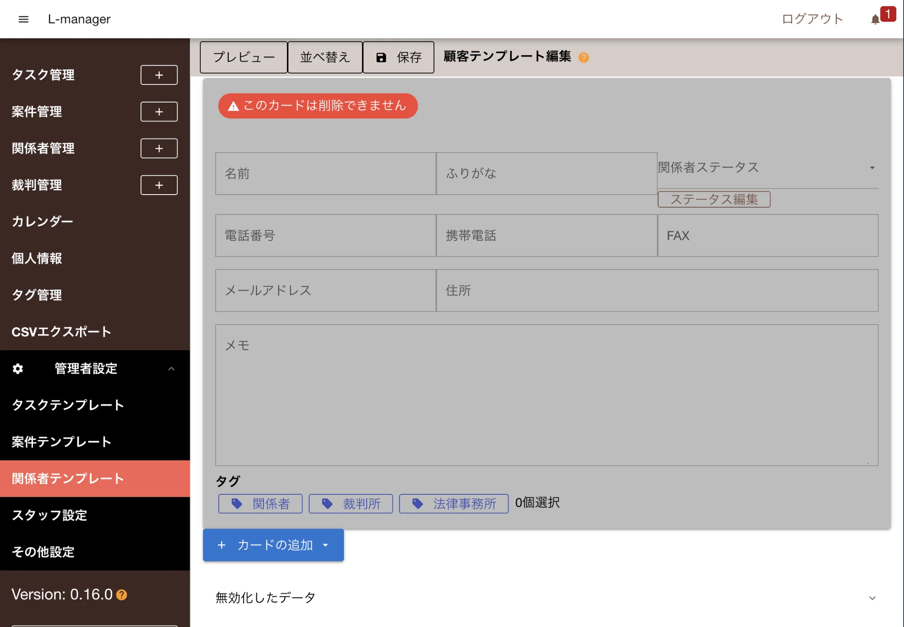
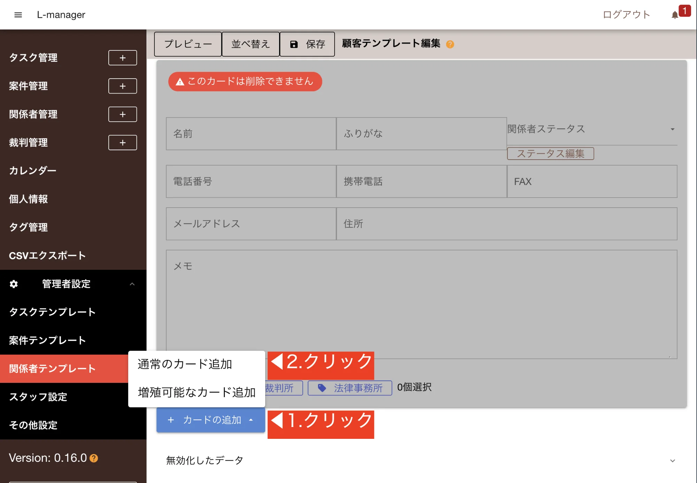

:::caution[テンプレートの編集は管理者権限が必要です]
:::

テンプレートとは、入力の雛形のことを指します。テンプレートは以下の項目で使用されます

- 案件登録
- タスク登録
- 顧客登録

それぞれにテンプレートを自由にカスタムすることができます。

## 固定フィールドとカスタムフィールド

<dl class="basic">
<dt>固定フィールド</dt>
<dd>予めシステムに組み込まれている入力フォームです。削除はできません。テンプレート編集画面ではグレースケールで表示されます</dd>
<dt>カスタムフィールド</dt>
<dd>ユーザが自由に追加・削除できる入力フォームです。</dd>
</dl>

テンプレートのカスタムは「カスタムフィールド」の追加削除をすることで行います。
固定フィールドは案件・タスク・関係者それぞれに異なるフィールドが設定されています。

固定フィールドの種類

<dl class="basic">
<dt>タスクの必須項目</dt>
<dd>「タイトル」「担当者」「タスクステータス」「カテゴリ」「案件番号」</dd>
<dt>案件の必須項目</dt>
<dd>「タイトル」「案件番号」「案件ステータス」</dd>
<dt>関係者の必須項目</dt>
<dd>「名前」「ふりがな」「関係者ステータス」「電話番号」「携帯電話」「FAX」「メールアドレス」「住所」「メモ」</dd>
</dl>

## テンプレートのカスタマイズ {#customize_template}

テンプレートには次の手順に従って行います

1. カードを追加する
2. カードの中に入力フィールドを追加する

### カードとは？

カードは入力フィールドを束ねる入れ物です。カードの種類は以下の２種類です

<dl class="basic">
<dt>通常のカード</dt>
<dd>普通のカードです。通常はこちらを使います。</dd>
<dt>増殖可能なカード</dt>
<dd>入力時にカード自体を増やすことができるタイプです。「依頼者」のように、複数人登録する可能性がある項目は増殖可能なカードを使用します。</dd>
</dl>

### 入力フィールドとは？

カードの中に登録する実際のフォームです。

<dl class="basic">
<dt>テキスト</dt>
<dd>テキスト入力フィールドです。2文字以上の検索に対応しています。本文入力に適しています</dd>
<dt>1文字検索対応テキスト</dt>
<dd>１文字の検索も可能なテキスト入力フィールドです。1文字の検索も可能ですが検索範囲が広く、検索ノイズが発生しやすくなります</dd>
<dt>日付と時刻</dt>
<dd>日付の入力フィールドです。締め日や報告日など、日付に関するフォームを増やしたいときに最適です</dd>
<dt>チェックボックス</dt>
<dd>YES/NOの二択で回答する際に便利なフォームです</dd>
<dt>選択</dt>
<dd>予め回答を用意しておき、選ぶだけで入力できるフォームです</dd>
<dt>ユーザ</dt>
<dd>スタッフアカウントの入力用です。例えば担当者や確認者といったフィールドを追加したい際にご利用下さい</dd>
<dt>関係者</dt>
<dd>登録されている関係者を選択入力できるフォームです。依頼者や相手方といった人を基準とした入力フォームに最適です</dd>
</dl>

### Step1.テンプレート編集画面を開く {#template_editor_ui}

早速テンプレートの編集をしてみましょう。ゴールは顧客テンプレートに「性別」と「血液型」フィールドを追加することを目指します。

1. 左メニュー「設定」をクリック
2. 「関係者ひな型」をクリック

編集画面が表示されました。

### Step2.カードの追加 {#add_card}

郵便番号を入力するフォームを追加するには、その入れ物となるカードの追加が必要です。  
郵便番号は通常１つしか無いため、「通常のカード」を追加します。

1. カードの追加ボタンをクリック
2. 通常のカード追加をクリック

### Step3.カードの中にフォームを追加する {#add_form_in_card}

追加されたカードはまだ空っぽです。ここに「性別」と「血液型」フィールドを追加します。
まずは性別の追加手順を見てみましょう。

1. カード内にある「追加」ボタンをクリックし、「選択」をクリック
2. ラベルに「性別」と入力
3. 選択肢の追加を１回クリック
4. 名前に「男性」と「女性」をそれぞれ分けて入力

:::note[プレビューでイメージを見てみよう]
画面上部のプレビューを押すと実際の入力イメージが確認できます
:::

同様の手順で、血液型も追加します

1. カード内にある「追加」ボタンをクリックし、「選択」をクリック
2. ラベルに「血液型」と入力
3. 選択肢の追加を3回クリック
4. 名前に「A型」「B型」「O型」「AB型」をそれぞれ分けて入力
5. ※必要に応じて色分けも可能

:::note[カードの幅って？]
カードの中の入力項目にはそれぞれ「半幅」と「全幅」の設定が可能です。半幅は２つ並べて１行になり、全幅は１つで１行を占有します。 好みのレイアウトに合わせて自由に設計が可能です。
:::

:::caution[入力フォームにはそれぞれ追加可能な上限があります]
:::

### Step4.保存する {#save}

プレビューで実際の入力イメージを確認してみましょう。

問題がなければ、最後に忘れず保存ボタンをクリックして下さい。

### 削除について {#delete_template_note}

不要になったカードや入力フォームの削除についてはこちらをご覧下さい

補足：削除について

カード自体の削除と、カード内の入力フォームの削除、２種類の削除があります。

カード自体の削除はカードに含まれるすべての入力フォームも含めて一括で削除します。  
カード内の入力フォーム削除の場合、対象の１フォームだけを削除します。

削除したフォームやカードは「無効化したデータ」の中に格納されます。この段階ではまだ復元が可能です。

