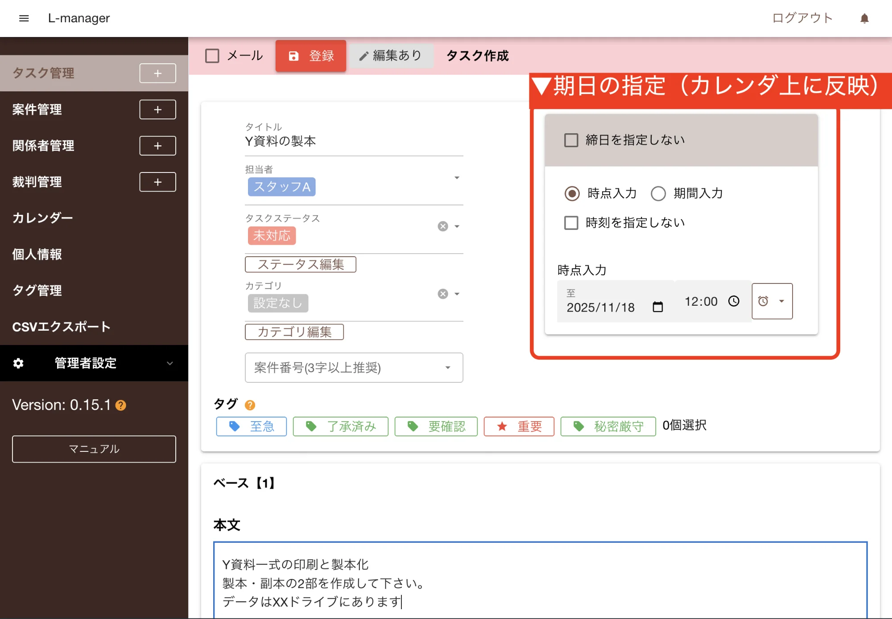
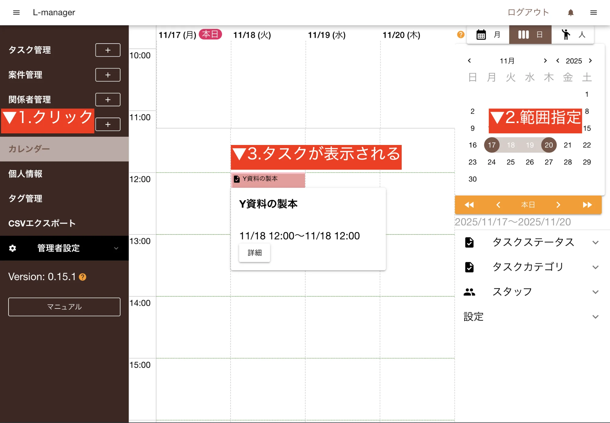

1. 期限・期間を設定しない場合は、「期限・期間を設定しない」をクリック（この場合、カレンダーにタスクは表示されません）
2. 期限・期間を設定する場合には、期限入力・期間入力のいずれかを選択し、期限・期間を入力
3. ※　時刻を指定しない場合は、「時刻を指定しない」をクリック
4. ※　カレンダー表示

### 補足

- 「締日を指定しない」→「期限・期間を設定しない」
- 「時点入力」→「期限入力」
