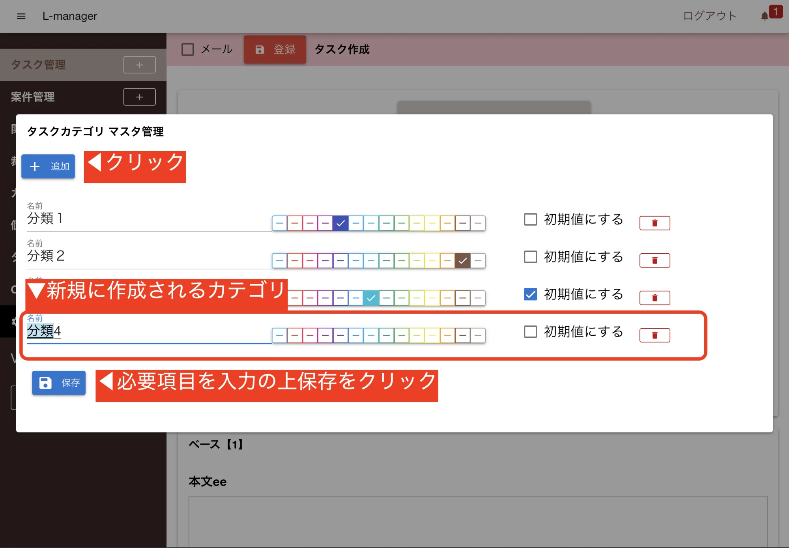

1. 「カテゴリ編集」をクリック
2. 「＋追加」をクリック
3. 「名前」を自由入力し、「色」を選択して、下の「保存」をクリック（保存ボタンは入力等をすると表示されます）
4. カテゴリのうち、初期値として設定したいものについては、「初期値にする」をクリック
5. カテゴリを編集する場合には、「名前」や「色」を選択のうえ、下の「保存」をクリック
6. カテゴリを削除する場合には、「削除ボタン」をクリックし、下の「保存」をクリック

▼

