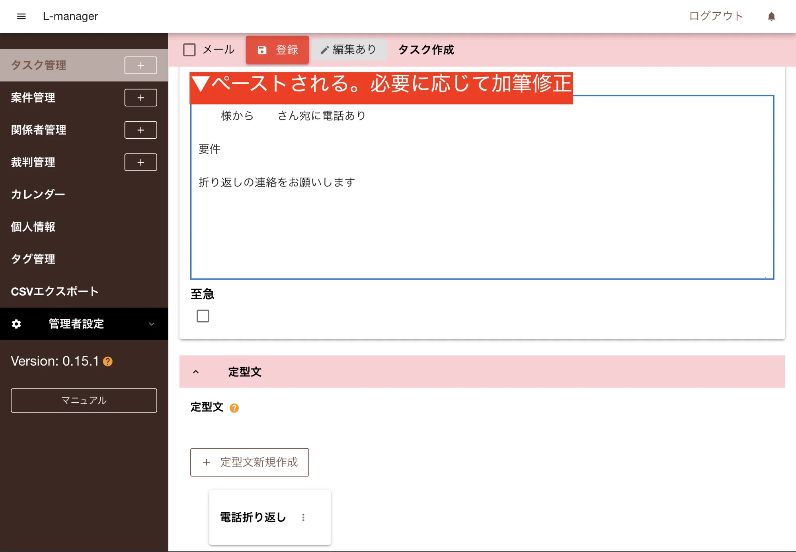

「本文」欄にテキストを入力する際、あらかじめ作成した定型文を使用することができます。

1. 「↓定型文」をクリック
2. 「＋定型文新規作成」をクリック
3. 「タイトル」「定型文」を入力して「保存」をクリック

- 「↓定型文」をクリックすると、保存した定型文のタイトルが表示され、タイトルをクリックすると、クリップボードにコピーされ、「本文」の上でペースト（右クリック→貼り付け）することで、定型文を本文に反映させることができます
- 保存した定型文を編集・削除する場合には「点点点」をクリックして選択してください

▼

▼

▼

▼

