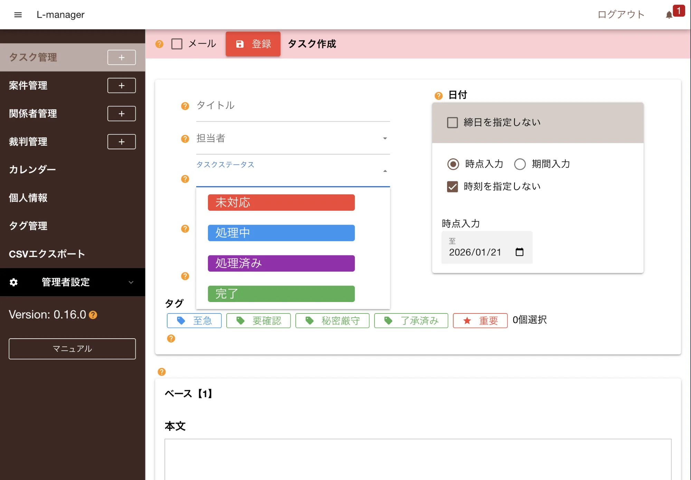
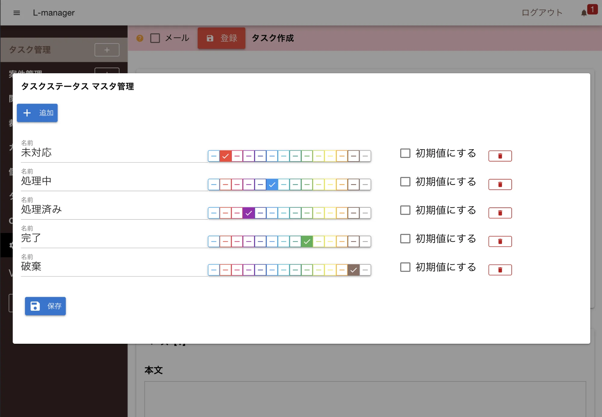

各データの現在の状態を「ステータス」と「カテゴリ」の２つで表すことができます。  
ステータスとカテゴリは任意に追加・削除が可能です。

## 初期のステータスとカテゴリ

L-managerを使い始めると予めいくつかのステータスとカテゴリが登録されています。

**案件ステータス**

- 未受任
- 受任済み
- 終了

**タスクステータス**

- 未対応
- 処理中
- 処理済み
- 完了

**タスクカテゴリ**

- 設定なし
- 電話連絡
- 期日
- 打ち合わせ

## ステータスまたはカテゴリを追加する

初期登録されているステータス・カテゴリで不足がある場合は、任意に追加が可能です。
ステータスの追加を基準に解説しますが、カテゴリ追加も同様の手順で操作可能です

1. 「ステータス編集」をクリック
2. 左上の「追加」ボタンをクリック
3. ステータスの名前と色を選択する
4. 保存ボタンをクリック（変更がある場合にのみ表示される）

:::tip[初期値にする？]
ステータス編集画面にある「初期値にする」にチェックを入れると、タスク登録画面を起動したとき自動でそのステータスがセットされます
:::
